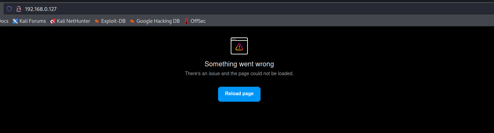
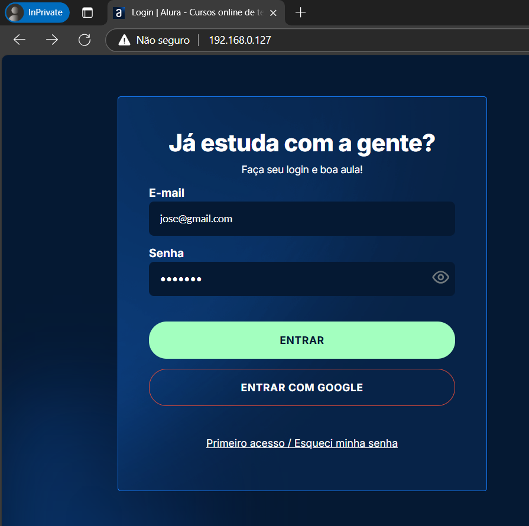
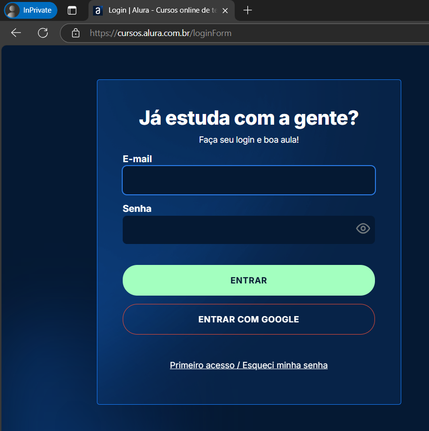
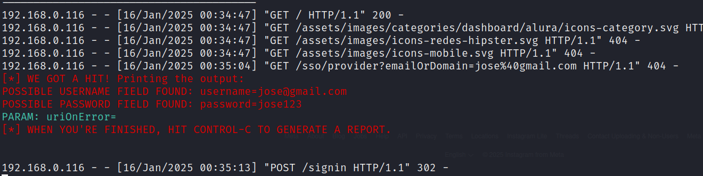

# Phishing para captura de senhas

### Ferramentas

- Kali Linux
- setoolkit

### Configurando o Phishing no Kali Linux

- Acesso root: ``` sudo su ```
- Iniciando o setoolkit: ``` setoolkit ```
- Tipo de ataque: ``` Social-Engineering Attacks ```
- Vetor de ataque: ``` Web Site Attack Vectors ```
- Método de ataque: ```Credential Harvester Attack Method ```
- Método de ataque: ``` Site Cloner ```
- Obtendo o endereço da máquina: ``` ifconfig ```
- URL para clone: https://cursos.alura.com.br/loginForm

### Desafios
- Na primeira tentativa, seguindo a aula do professor, com o site do Facebook como base não obtive sucesso,
  a ferramenta apresentou erro, pesquisando em fóruns encontrei colegas que tiveram problemas semelhantes
  e testei suas dicas, a conclusão foi de que alguns sites não eram compatíveis com alguns códigos da ferramenta.

### Um exemplo de site incompatível é o site do Instagram:



- Ao escolher o site da Alura como base consegui executar o projeto com sucesso, funcionando como o modelo
  apresentado pelo professor, o site de phishing coleta as credenciais e direciona o usuário para o site
  original rapidamente:

### Phishing:
  


### Site Oficial:
  


### Resutados

- Captura de credenciais concluída com sucesso!


